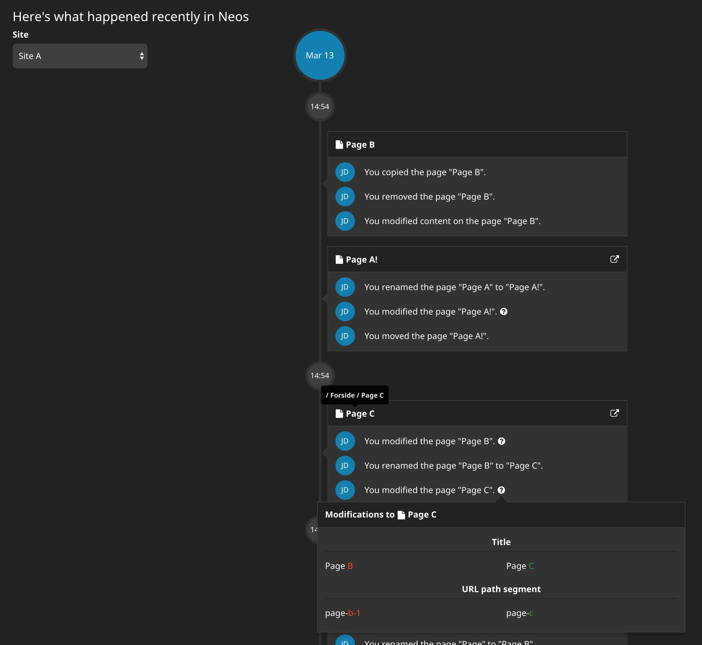
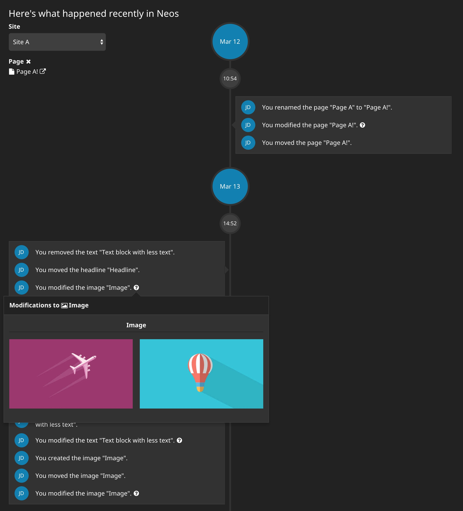
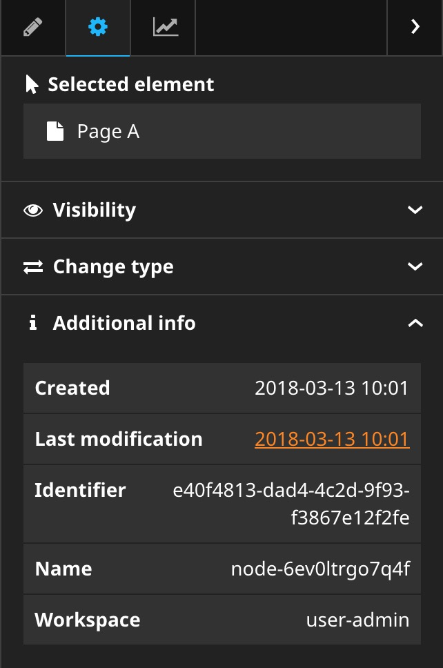

# AE.History

## Introduction

This package provides an improved history backend module for Neos.

It provides an improved event overview with site filtering, viewing for a specific document node as well as actual view of changes.

Additionally provides a link in the node info view for document nodes in the content module.

Hides account creation/deletion events.

Compatible with Neos 2.3+

## Installation

`composer require "aertmann/history:~1.0"`

## Screenshots

General overview with site selection

View of history for specific page

Inspector link to history for specific page

